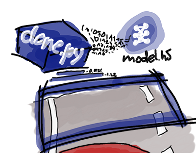

# Self Driving Car Engineer Project 3 - Behavioural Cloning of Camera-Based Steering Control with Neural Networks
## Benjamin Söllner, 30 May 2017

---



---

## The Project
The goals / steps of this project are the following:
* Use the simulator to collect data of good driving behavior
* Design, train and validate a model that predicts a steering angle from image data
* Use the model to drive the vehicle autonomously around the first track in the simulator. The vehicle should remain on the road for an entire loop around the track.
* Summarize the results with a written report

### Dependencies

This project requires:

* [CarND Term1 Starter Kit](https://github.com/udacity/CarND-Term1-Starter-Kit): The lab enviroment can be created with CarND Term1 Starter Kit. Click [here](https://github.com/udacity/CarND-Term1-Starter-Kit/blob/master/README.md) for the details.
* [Self Driving Car Simulator](https://github.com/udacity/self-driving-car-sim) from the Udacity Self Driving Car Nanodegree
* Training data, e.g. the official [Udacity training data](https://d17h27t6h515a5.cloudfront.net/topher/2016/December/584f6edd_data/data.zip)

The following resources can be found in this github repository:
* [clone.py](clone.py) containing the script to create and train the model
* [drive.py](drive.py) for driving the car in autonomous mode
* [model.h5](model.h5) containing a trained convolution neural network
* [writeup_report.md](writeup_report.md) and [writeup_report.html](writeup_report.html) summarizing the results
* [video.mp4](video.mp4) the video that shows the car driving around the track

## Details About Files In This Directory

### `drive.py`

Usage of `drive.py` requires you have saved the trained model as an h5 file, i.e. `model.h5`. See the [Keras documentation](https://keras.io/getting-started/faq/#how-can-i-save-a-keras-model) for how to create this file using the following command:
```sh
model.save(filepath)
```

Once the model has been saved, it can be used with drive.py using this command:

```sh
python drive.py model.h5
```

The above command will load the trained model and use the model to make predictions on individual images in real-time and send the predicted angle back to the server via a websocket connection.

Note: There is known local system's setting issue with replacing "," with "." when using drive.py. When this happens it can make predicted steering values clipped to max/min values. If this occurs, a known fix for this is to add "export LANG=en_US.utf8" to the bashrc file.

Saving a video of the autonomous agent:

```sh
python drive.py model.h5 run1
```

The fourth argument `run1` is the directory to save the images seen by the agent to. If the directory already exists it'll be overwritten.

```sh
ls run1

[2017-01-09 16:10:23 EST]  12KiB 2017_01_09_21_10_23_424.jpg
[2017-01-09 16:10:23 EST]  12KiB 2017_01_09_21_10_23_451.jpg
[2017-01-09 16:10:23 EST]  12KiB 2017_01_09_21_10_23_477.jpg
[2017-01-09 16:10:23 EST]  12KiB 2017_01_09_21_10_23_528.jpg
[2017-01-09 16:10:23 EST]  12KiB 2017_01_09_21_10_23_573.jpg
[2017-01-09 16:10:23 EST]  12KiB 2017_01_09_21_10_23_618.jpg
[2017-01-09 16:10:23 EST]  12KiB 2017_01_09_21_10_23_697.jpg
[2017-01-09 16:10:23 EST]  12KiB 2017_01_09_21_10_23_723.jpg
[2017-01-09 16:10:23 EST]  12KiB 2017_01_09_21_10_23_749.jpg
[2017-01-09 16:10:23 EST]  12KiB 2017_01_09_21_10_23_817.jpg
...
```

The image file name is a timestamp when the image image was seen. This information is used by `video.py` to create a chronological video of the agent driving.

### `video.py`

```sh
python video.py run1
```

Create a video based on images found in the `run1` directory. The name of the video will be name of the directory following by `'.mp4'`, so, in this case the video will be `run1.mp4`.

Optionally one can specify the FPS (frames per second) of the video:

```sh
python video.py run1 --fps 48
```

The video will run at 48 FPS. The default FPS is 60.

### `clone.py`

This file does the actual training of the model You can run the training pipeline like so:

```sh
python clone.py
```

The script will assume the following:
* It will assume training data (csv and images from the self driving car simulator) to be stored in the ``data`` subdirectory
* It will write a ``model_*.h5`` file to the main directory (after training)
