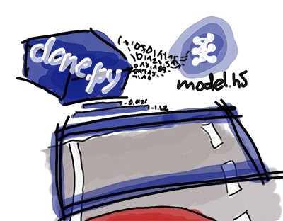

# Self Driving Car Engineer Project 3 - Behavioural Cloning of Camera-Based Steering Control with Neural Networks
## Benjamin Söllner, 30 May 2017

---



---

The goals / steps of this project are the following:
* Use a self-driving car simulator to collect data of good driving behavior
* Build, a convolution neural network in Keras that predicts steering angles from images
* Train and validate the model with a training and validation set
* Test that the model successfully drives around track one without leaving the road
* Summarize the results with a written report

## Rubric Points
Here I will consider the [rubric points](https://review.udacity.com/#!/rubrics/432/view) individually and describe how I addressed each point in my implementation.  

### Files Submitted & Code Quality

**1. Submission includes all required files and can be used to run the simulator in autonomous mode**

My project includes the following files:
* [clone.py](clone.py) containing the script to create and train the model
* [drive.py](drive.py) for driving the car in autonomous mode
* [model.h5](model.h5) containing a trained convolution neural network
* [writeup_report.md](writeup_report.md) and [writeup_report.html](writeup_report.html) summarizing the results
* [video.mp4](video.mp4) the video that shows the car driving around the track

**2. Submission includes functional code**

Using the Udacity provided simulator and my drive.py file, the car can be driven autonomously around the track by executing
```sh
python drive.py model.h5
```
**3. Submission code is usable and readable**

The model.py file contains the code for training and saving the convolution neural network. The file shows the pipeline I used for training and validating the model, and it contains comments to explain how the code works. The file also contains a (deactivated) second pipeline that was tried, but eventually not used, since it yielded no useful results.

### Model Architecture and Training Strategy

**1. An appropriate model architecture has been employed**

My model consists of
* five convolution layers with 5x5, 5x5, 5x5, 3x3 and 3x3 kernel size (clone.py, lines 79-91), all with a ReLU activation function
* then four fully-connected layers mapping to 100, 50, 10 and 1 neuron each, the last neuron outputting the final steering estimate

The model therefore copies the [NVidia architecture](https://devblogs.nvidia.com/parallelforall/deep-learning-self-driving-cars/). Other approaches have been tried but could improve no visible results (see Solution Architecture below).

The data is normalized using a Lamda layer (clone.py, line 73).

**2. Attempts to reduce overfitting in the model**

In order to avoid overfitting, the following strategies have been applied:
* The first three convolutional layers have been subsampled (with factor 2 in each dimension).
* The data was cropped to the lower section of the images, assuming that the lane is mostly visible there (clone.py, line 74).
* Image augmentation has been applied: for each image, the flipped image (with reversed steering measurement) was also added (clone.py, lines 38-41)

The model was tested by running it through the simulator and ensuring that the vehicle could stay on the track.

**3. Model parameter tuning**

The model used an adam optimizer, so the learning rate was not tuned manually (clone.py, line 90-92). 5 Epochs seemed to be enough to avoid overfitting.

**4. Appropriate training data**

The [Udacity training data](https://d17h27t6h515a5.cloudfront.net/topher/2016/December/584f6edd_data/data.zip) was used for training. I am a terrible gamer and didn't find the time to get a joystick. Using the mouse or keyboard didn't get high-enough quality data to be used and the Udacity training data seemed to be sufficient to train the model properly.

### Model Architecture and Training Strategy

**1. Solution Design Approach**

Checking out the github-history of this project, you will notice, that I tried out different strategies. Some approaches were messed up by the fact that I found out pretty late that I reversed the signs for steering angles for the left and right camera image. Oops.

What proved useful:
* Due to a quirk in CV2, a color conversion needed to be implemented (``cv2.cvtColor(..., cv2.COLOR_BGR2RGB)``)
* I reduced the batch size from 128 in the project to 32
* I reduced the correction factor

Things that didn't affect much:
* adding another convolutional layer with kernel size 3 which mapped from 3 channels to one channel, thereby letting the neural network handle the RGB-to-1-channel conversion.
* concerning the image augmentation (adding flipped images): some people from the forums preferred to use only one version of the augmented and original image for every data point. It didn't change results for me.
* adding dropout to the NVidia model (first fully connected layer)
* removing subsampling
* scaling the image down to half width and height (essentially another layer of subsampling)
* I tried different models, that didn't work nearly as well: a very simple, fully connected model, the [comma.ai](https://github.com/commaai/research) (which you can still see "de-activated" in the code) and a "LeNet" style model.

Things that I would have tried (but did not do in the interest of time):
* Other models: e.g., the VGG16 model or modifications to the comma.ai model (without cropping or perhaps with different resolution)
* Trying out ReLUs instead of ELUs for the NVidia model
* "introspection" models which combine ("ensemble") the predictions of multiple models
* using technologies to store and re-load the structure and weights of models in order to successfully train on additionally generated data
* adding image augmentation techniques: adding augmented images with lateral perturbations, drop shadows across sections of the image or different levels of brightness

Training and validation loss were constantly monitored. If both decreased over the course of training, the model was tested in the simulator.

**2. Final Model Architecture**

The final model is a sequential neural network with the following layers:

* Input Image of shape 120x320x3
* Cropping away the top 70 and bottom 25 pixel (output: 25x320x3)
* Convolutional Layer with 5x5 kernel, 24 output dimensions, 2x2 subsampling and relu activation (output: 13x160x24)
* Convolutional Layer with 5x5 kernel, 36 output dimensions, 2x2 subsampling and relu activation (output: 7x80x36)
* Convolutional Layer with 5x5 kernel, 48 output dimensions, 2x2 subsampling and relu activation (output: 4x80x48)
* Convolutional Layer with 3x3 kernel, 64 output dimensions and relu activation (output: 4x80x64)
* Convolutional Layer with 3x3 kernel, 64 output dimensions and relu activation (output: 4x80x64)
* Flattening to 20480 neurons
* Fully connecting those to 100 neurons
* Fully connecting those to 50 neurons
* Fully connecting those to 10 neurons
* Fully connecting those to 1 neuron

**3. Creation of the Training Set & Training Process**

As indicated previously, I am a terrible gamer and got only mediocre results using the keyboard or mouse inputs. Instead I used the [Udacity training data](https://d17h27t6h515a5.cloudfront.net/topher/2016/December/584f6edd_data/data.zip), which was sufficient with the NVidia model.

The images provided were images taken from the left, center and right camera of the simulator. They were fed into the neural network with a steering angle correction term +0.1/0.0/-0.1.


There are 8036x3 = 24108 images and 20% of those images are split off to the validation set in order to test for overfitting.

Training was done on a [Microsoft Azure Data Science VM](https://docs.microsoft.com/en-US/azure/machine-learning/machine-learning-data-science-provision-vm), which increased training time 5-fold and free'd up my workstation to work on other things in the meantime.

From the below graph you can see, that the model generalizes pretty well for 3 epochs, at the fourth epoch, it slightly overfits, but during the 5th epoch, validation loss decreases again.


